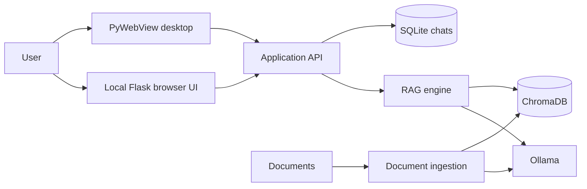

<div align="center">

# On-Prem RAG Assistant

### A laptop-first document assistant powered by local LLMs and cited retrieval.

Ask questions across PDFs, Word files, text, and Markdown without sending them
to a hosted AI API.

[](https://python.org)
[](https://ollama.com)
[](LICENSE)

</div>

> Public preview: the desktop and browser modes are intended for one trusted
> user. Authentication and safe multi-user deployment are not implemented yet.

## What it does

- Runs answer generation and embeddings through a local Ollama instance
- Builds a persistent ChromaDB index from local documents
- Streams answers with source-document citations
- Supports PDF, DOCX, TXT, Markdown, and per-chat attachments
- Persists chats and extracted attachments in local SQLite
- Runs as a native PyWebView window or in a browser
- Includes an ISO 9001 sample use case, while remaining domain-agnostic

## Why this project

Private policies, quality manuals, contracts, and operating procedures are often
poor candidates for hosted AI services. On-Prem RAG Assistant is an inspectable
reference implementation for applying a local model to those documents.

Local execution is a useful privacy control, not a compliance certification.
Operators remain responsible for access control, encryption, retention, model
configuration, and regulatory requirements.

## Quick start

### Requirements

- Python 3.10 or newer
- [Ollama](https://ollama.com/download)
- 8 GB RAM minimum; 16 GB recommended for a 7B model
- Internet access during initial dependency and model installation

### Automated setup

Windows:

```bat
scripts\setup.bat
```

macOS or Linux:

```bash
chmod +x scripts/setup.sh run.sh run_web.sh
./scripts/setup.sh
```

The setup creates `.venv`, installs the project, and pulls
`nomic-embed-text` and `qwen2.5:7b`.

### Manual setup

```bash
python -m venv .venv
source .venv/bin/activate
# Windows: .venv\Scripts\activate
python -m pip install -e .
ollama pull nomic-embed-text
ollama pull qwen2.5:7b
```

Copy `.env.example` to `.env` if you want to override defaults.

## Run it

Desktop:

```bash
./run.sh
# Windows: run.bat
```

Browser:

```bash
./run_web.sh
# Windows: run_web.bat
```

Open <http://localhost:5000>. Browser mode listens only on `127.0.0.1` by
default.

Add documents through the Knowledge Base screen or place them in
`data/documents/`, then select **Rebuild Knowledge Base**.

Try the documents under [`examples/`](examples/) with the questions in
[`examples/sample-questions.md`](examples/sample-questions.md).

## Architecture



## Configuration

| Variable | Default | Purpose |
|---|---|---|
| `OLLAMA_BASE_URL` | `http://localhost:11434` | Ollama endpoint |
| `LLM_MODEL` | `qwen2.5:7b` | Answer model |
| `EMBED_MODEL` | `nomic-embed-text` | Embedding model |
| `TOP_K` | `3` | Maximum retrieved chunks |
| `MAX_COSINE_DISTANCE` | `0.65` | Retrieval rejection threshold |
| `ALLOW_NETWORK_ACCESS` | `false` | Bind browser mode to the LAN |

Changing the embedding model requires rebuilding the knowledge base.

## Security and privacy

- Documents, extracted attachments, embeddings, chat messages, and logs remain
  on the configured host when Ollama is local.
- These artifacts are stored without application-level encryption.
- A remote `OLLAMA_BASE_URL` receives prompts and retrieved document content.
- LAN mode has no authentication. Do not expose it to an untrusted network or
  the public internet.
- Uploaded files are limited to supported document extensions and 25 MB per
  request, but untrusted document parsing should still be treated cautiously.

See [SECURITY.md](SECURITY.md) for reporting and deployment guidance.

## Current limitations

- No authentication, roles, or tenant isolation
- Text-only PDFs; scanned files require OCR first
- Citations identify source chunks but are not a guarantee of answer correctness
- No reranker or automated RAG evaluation suite yet
- SQLite content and logs are not encrypted by the application
- Packaged desktop installers are not currently published

## Roadmap

- Retrieval evaluation dataset and repeatable quality metrics
- Optional reranking and hybrid search
- Encrypted local storage
- Authenticated multi-user deployment
- Document version tracking and audit exports
- Reproducible signed desktop releases

The detailed roadmap is in [docs/roadmap.md](docs/roadmap.md).

## Contributing

Issues, test results on different hardware, retrieval improvements, and focused
pull requests are welcome. Start with [CONTRIBUTING.md](CONTRIBUTING.md).

If you are evaluating private document AI for a real organization and want to
discuss implementation work, open a GitHub Discussion in this repository.

## License

[MIT](LICENSE)
